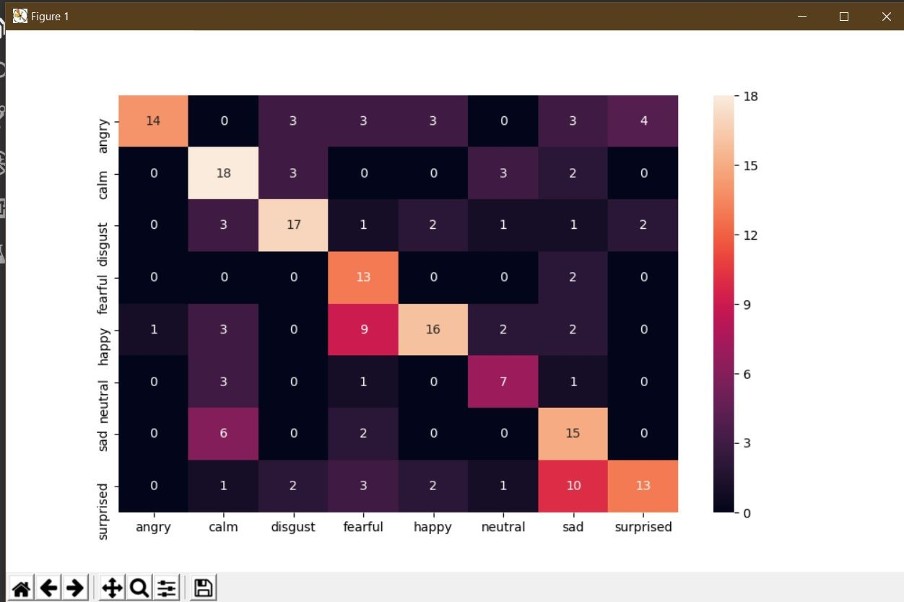
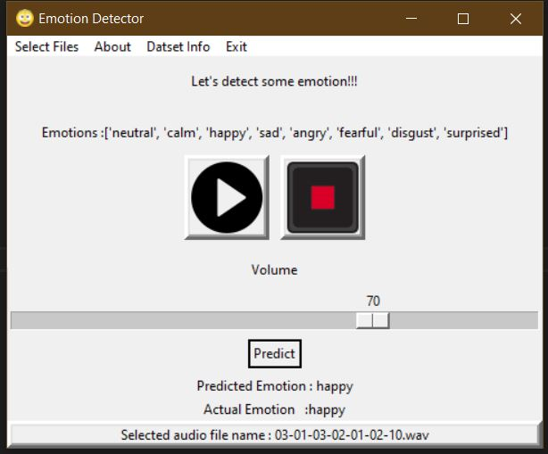

# Audio Emotion Detector


[](https://jupyter.org/try)

---

This repo contains Python implemenation for audio emotion detection using Support Vector Machines (Sklearn library)

Dataset used : [The Ryerson Audio-Visual Database of Emotional Speech and Song (RAVDESS)](https://zenodo.org/record/1188976#.YRvbUogzZPZ)

## Results

---

### Confusion Matrix



### GUI using [ Tkinter ](https://docs.python.org/3/library/tkinter.html)



## Dataset Reference

```
@dataset{livingstone_steven_r_2018_1188976,
  author       = {Livingstone, Steven R. and
                  Russo, Frank A.},
  title        = {{The Ryerson Audio-Visual Database of Emotional
                   Speech and Song (RAVDESS)}},
  month        = apr,
  year         = 2018,
  note         = {{Funding Information Natural Sciences and
                   Engineering Research Council of Canada:
                   2012-341583  Hear the world research chair in
                   music and emotional speech from Phonak}},
  publisher    = {Zenodo},
  version      = {1.0.0},
  doi          = {10.5281/zenodo.1188976},
  url          = {https://doi.org/10.5281/zenodo.1188976}
}
```
